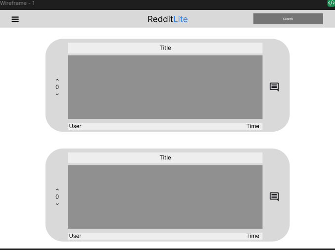
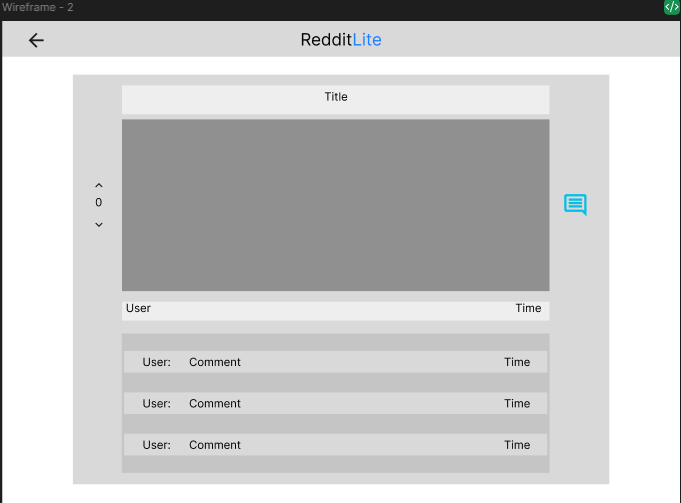

# Reddit App Clone

## 🌐 Live Demo
[Check it out here](https://redditliteapp.netlify.app)

## 🔧 Technologies Used
- React
- Redux Toolkit
- React Router
- Jest / Enzyme
- Cypress
- Vite

## 📐 Wireframes / Screenshots

## ✨ Features
- Search Reddit posts
- Filter by category
- Responsive design
- Animations & transitions

## 📌 Future Work
- User login
- Bookmark posts

